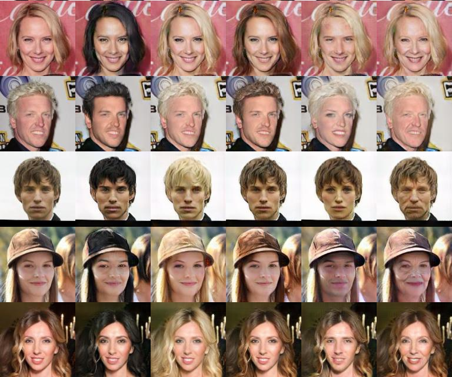

# 
HTTP : Hyper Typography Transfer Pipeline

## Abstract
With the development of the computer and the Internet, the amount of text produced by word processors is increasing. Typography plays an important role in computer text as well as in handwriting. If we utilize the typography, we can express not only the textual meaning, but also various expressions such as the author’s intention and feelings. In creating a typography, there are two major difficulties. One is to maintain the style for all characters, and the other is to create all characters manually. Especially, a large character set like Chinese. We map the production of a typography to a style transfer task in the sense of data as character images. Based on the style transfer model, we devise a Hyper-Typography Transfer Pipeline(HTTP) that takes a character subset as an input and automatically completes all character set while maintaining the style. There are advantages and disadvantages of character image dataset for style transfer task compared with general images. Whole character images, supported by type-file, have labels, so it has the advantage of being able to supervised learning. However, to deceive people with plausible images is difficult, and also laborious to distinguish subtle differences in styles. Our model is based on the existing style transfer models. But they have some drawbacks to these character image dataset. First one is that there are limitation to represent thousands of characters with one-hot vector labels. To solve this problem, we embedded the character images to style vector and content vector. Another one is that existing style transfer models do not support cross-domain transfer. For style transfer from unfixed inputs to all characters, a single-domain transfer model requires a number of models corresponding to the square of the total number of characters. Therefore, we propose a cross-domain transfer model that can transfer styles between different characters. We also add new losses to generate character images which are strict to one stroke. We utilized an explicit score using structural similarity(SSIM) [[1](https://ieeexplore.ieee.org/document/1284395/)], and obtained higher scores than existing baselines.

## Paper
[HTTP:Hyper-Typography Transfer Pipeline](https://arxiv.org/)  
[Yonggyu Park](https://github.com/yongqyu), [Junhyun LEE](https://github.com/LeeJunHyun), [Yookyung Koh](https://github.com/yookyungKoh), [Inyeop Lee](https://github.com/inyeoplee77), [Jaewoo Kang](http://infos.korea.ac.kr/kang/)

## Results
### Character Image Style Transfer

Chinese 
 
English 
 

### General Image Style Transfer
 

## Acknowledgments
Code is inspired by [StarGAN](https://github.com/yunjey/StarGAN)
